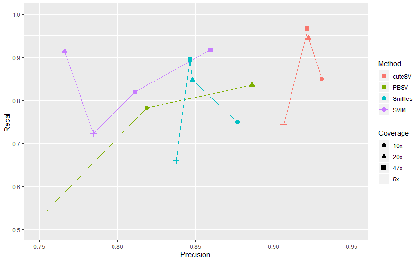
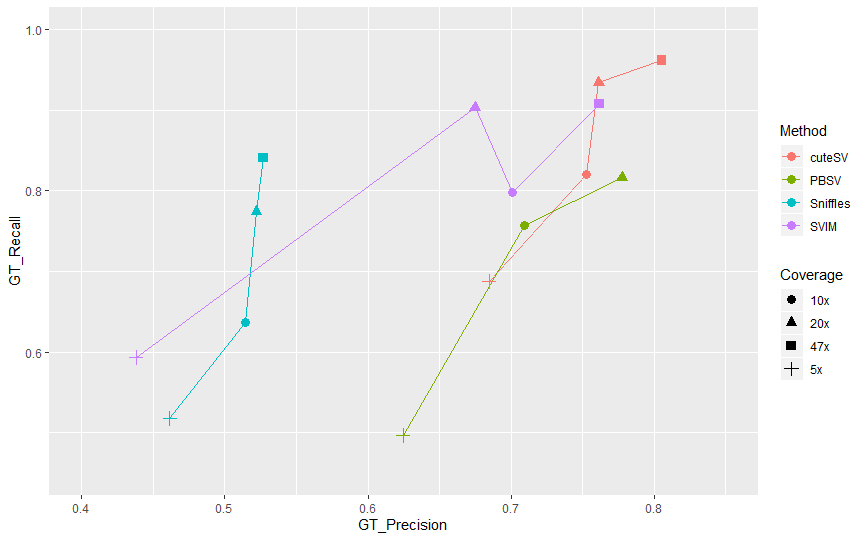

# Structural Variant Calling Benchmark

This benchmark is based on the publicly available long-read sequencing data (i.e., Oxford Nanopore PromethION long-reads) of the Ashkenazim son HG002/NA24385. I provide each step how to reproduce the final metrics with publicly available tools.

Thanks for [armintoepfer's](https://github.com/armintoepfer) great works!

# Comparison

#### Coverage titration for 5, 10, 20 and 47-fold:

**Fig 1. Recall & Precision**



**Fig 2. GT-Recall & GT-Precision**



#### At 5-fold coverage:

|Method|F1 %|Precision %|Recall %|GT-F1 %|GT-Precision %|GT-Recall %|
|:-:|:-:|:-:|:-:|:-:|:-:|:-:|
|[**pbsv**](https://github.com/PacificBiosciences/pbsv)| 63.20| 75.45| 54.37| 55.33| 62.46| 49.66|
|[**svim**](https://github.com/eldariont/svim)| 75.25| 78.43| 72.33| 50.40| 43.80| 59.34|
|[**sniffles**](https://github.com/fritzsedlazeck/Sniffles)| 73.89| 83.74| 66.11| 48.82| 46.15| 51.81|
|[**cuteSV**](https://github.com/tjiangHIT/cuteSV)| **81.74**| **90.63**| **74.44**| **73.66**| **76.45**| **71.07**|

#### At 10-fold coverage:

|Method|F1 %|Precision %|Recall %|GT-F1 %|GT-Precision %|GT-Recall %|
|:-:|:-:|:-:|:-:|:-:|:-:|:-:|
|[**pbsv**](https://github.com/PacificBiosciences/pbsv)| 79.99| 81.86| 78.20| 73.23| 70.96| 75.66|
|[**svim**](https://github.com/eldariont/svim)| 81.55| 81.11| 81.99| 74.60| 70.09| 79.74|
|[**sniffles**](https://github.com/fritzsedlazeck/Sniffles)| 80.80| 87.66| 74.94| 56.90| 51.42| 63.69|
|[**cuteSV**](https://github.com/tjiangHIT/cuteSV)| **88.85**| **93.07**| **85.00**| **83.83**| **84.00**| **83.65**|


#### At 20-fold coverage:

|Method|F1 %|Precision %|Recall %|GT-F1 %|GT-Precision %|GT-Recall %|
|:-:|:-:|:-:|:-:|:-:|:-:|:-:|
|[**pbsv**](https://github.com/PacificBiosciences/pbsv)| 85.98| 88.60| 83.52| 79.65| 77.75| 81.64|
|[**svim**](https://github.com/eldariont/svim)| 83.35| 76.60| 91.39| 77.26| 67.49| 90.34|
|[**sniffles**](https://github.com/fritzsedlazeck/Sniffles)| 84.78| 84.78| 84.78| 62.37| 52.21| 77.43|
|[**cuteSV**](https://github.com/tjiangHIT/cuteSV)| **93.34**| **92.22**| **94.49**| **90.13**| **86.44**| **94.15**|

#### At 47-fold coverage: (pbsv crashed!)

|Method|F1 %|Precision %|Recall %|GT-F1 %|GT-Precision %|GT-Recall %|
|:-:|:-:|:-:|:-:|:-:|:-:|:-:|
|[**pbsv**](https://github.com/PacificBiosciences/pbsv)|--|--|--|--|--|--|
|[**svim**](https://github.com/eldariont/svim)| 88.74| 85.95| 91.72| 82.82| 76.16| 90.76|
|[**sniffles**](https://github.com/fritzsedlazeck/Sniffles)| 86.98| 84.63| 89.46| 64.78| 52.69| 84.09|
|[**cuteSV**](https://github.com/tjiangHIT/cuteSV)| **94.33**| **92.15**| **96.61**| **91.98**| **87.91**| **96.45**|


# Get tools

Information how to install `conda` and add the `bioconda` channel is available
on https://bioconda.github.io/.

```sh
conda create --name sv python=3
source activate sv
conda install minimap2==2.17 pbsv==2.2.0 svim==1.2.0 sniffles==1.0.11 cuteSV==1.0.3 truvari==1.2 samtools bgzip tabix
```

# Get data
1) Create directory structure:
```sh
mkdir -p fastqs ref alns tools/{pbsv,sniffles,svim,cuteSV} giab
```

2) Download genome in a bottle annotations:
```sh
FTPDIR=ftp://ftp-trace.ncbi.nlm.nih.gov/giab/ftp/data/AshkenazimTrio/analysis/
curl -s ${FTPDIR}/NIST_SVs_Integration_v0.6/HG002_SVs_Tier1_v0.6.bed > giab/HG002_SVs_Tier1_v0.6.bed
curl -s ${FTPDIR}/NIST_SVs_Integration_v0.6/HG002_SVs_Tier1_v0.6.vcf.gz > giab/HG002_SVs_Tier1_v0.6.vcf.gz
```

3) Download hg19 reference with decoys and map non-ACGT characters to N:
```sh
curl -s ftp://ftp-trace.ncbi.nih.gov/1000genomes/ftp/technical/reference/phase2_reference_assembly_sequence/hs37d5.fa.gz > ref/human_hs37d5.fasta.gz
gunzip ref/human_hs37d5.fasta.gz
sed -i '/^[^>]/ y/BDEFHIJKLMNOPQRSUVWXYZbdefhijklmnopqrsuvwxyz/NNNNNNNNNNNNNNNNNNNNNNNNNNNNNNNNNNNNNNNNNNNN/' ref/human_hs37d5.fasta
```

4) Download hg19 tandem repeat annotations:
```sh
curl -s https://raw.githubusercontent.com/PacificBiosciences/pbsv/master/annotations/human_hs37d5.trf.bed > ref/human_hs37d5.trf.bed
```

5) Download all `.fastq` files:
```sh
FTPDIR=ftp://ftp.ncbi.nlm.nih.gov/giab/ftp/data/AshkenazimTrio/HG002_NA24385_son/UCSC_Ultralong_OxfordNanopore_Promethion/
for fastq in $(curl -s -l ${FTPDIR} | grep '.fastq'); do curl -s ${FTPDIR}${fastq} > fastqs/${fastq}; done
for fastq in `ls fastqs`; do gunzip fastqs/${fastq}; done
```

# Alignment

6) Align each movie:
```sh
for i in `ls fastqs/`;do
    minimap2 ref/human_hs37d5.fasta fastq/$i -a -z 600,200 -x map-ont \
        --MD -Y -o alns/$i.sam -R '@RG\tID:hg2'
done
```

7) Alignments sorting and merging:
```sh
for i in `ls alns/`;do
    samtools view -buS alns/$i | samtools sort -O bam -T ./ - > alns/$i.bam
done
for i in `ls alns/*.bam`; do echo $i; done > input_bam.fofn
samtools merge alns/GM24385_all.bam -b input_bam.fofn && samtools index alns/GM24385_all.bam
```

# Run pbsv

8a) Discover SV signatures for each alignment, can be done in parallel:
```sh
pbsv discover alns/GM24385_all.bam tools/pbsv/hg2_ont.svsig.gz" --tandem-repeats ref/human_hs37d5.trf.bed
```

8b) Call and polish SVs:
```sh
pbsv call ref/human_hs37d5.fasta tools/pbsv/hg2_ont.svsig.gz tools/pbsv/hg2_ont.pbsv.vcf -t INS,DEL
bgzip tools/pbsv/hg2_ont.pbsv.vcf
tabix tools/pbsv/hg2_ont.pbsv.vcf.gz
```

# Run svim

9a) Run svim:
```sh
svim alignment tools/svim alns/GM24385_all.bam ref/human_hs37d5.fasta --min_sv_size 30
```

9b) Prepare for truvari:
```sh
cat tools/svim/final_results.vcf \
    | sed 's/INS:NOVEL/INS/g' \
    | sed 's/DUP:INT/INS/g' \
    | sed 's/DUP:TANDEM/INS/g' \
    | awk '{ if($1 ~ /^#/) { print $0 } else { if($5=="<DEL>" || $5=="<INS>") { print $0 }}}' \
    | grep -v 'SUPPORT=1;\|SUPPORT=2;\|SUPPORT=3;\|SUPPORT=4;\|SUPPORT=5;\|SUPPORT=6;\|SUPPORT=7;\|SUPPORT=8;\|SUPPORT=9;' \
    | sed 's/q5/PASS/g' > tools/svim/hg2_ont.svim.vcf
bgzip tools/svim/hg2_ont.svim.vcf
tabix tools/svim/hg2_ont.svim.vcf.gz
```

# Run sniffles

10a) Run sniffles:
```sh
sniffles -s 10 -l 30 -m alns/GM24385_all.bam -v tools/sniffles/hg2_ont.sniffles.vcf --genotype
```
10b) Prepare for truvari:
```sh
cat <(cat tools/sniffles/hg2_ont.sniffles.vcf | grep "^#") \
    <(cat tools/sniffles/hg2_ont.sniffles.vcf | grep -vE "^#" | \
      grep 'DUP\|INS\|DEL' | sed 's/DUP/INS/g' | sort -k1,1 -k2,2g) \
    | bgzip -c > tools/sniffles/hg2_ont.sniffles.vcf.gz
tabix tools/sniffles/hg2_ont.sniffles.vcf.gz
```

# Run cuteSV

11a) Run cuteSV:
```sh
cuteSV alns/GM24385_all.bam tools/cuteSV/hg2_ont.cuteSV.vcf ./ -s 10 -l 30
```
11b) Prepare for truvari:
```sh
grep -v 'INV\|DUP\|BND' tools/cuteSV/hg2_ont.cuteSV.vcf | bgzip -c > tools/cuteSV/hg2_ont.cuteSV.vcf.gz
tabix tools/cuteSV/hg2_ont.cuteSV.vcf.gz
```

# Final comparison

11) Compare to ground truth:
```sh
truvari -f ref/human_hs37d5.fasta -b giab/HG002_SVs_Tier1_v0.6.vcf.gz\
        --includebed giab/HG002_SVs_Tier1_v0.6.bed -o bench-pbsv --passonly\
        --giabreport -r 1000 -p 0.00 -c tools/pbsv/hg2.pbsv.vcf.gz
truvari -f ref/human_hs37d5.fasta -b giab/HG002_SVs_Tier1_v0.6.vcf.gz\
        --includebed giab/HG002_SVs_Tier1_v0.6.bed -o bench-svim --passonly\
        --giabreport -r 1000 -p 0.00 -c tools/svim/hg2.svim.vcf.gz
truvari -f ref/human_hs37d5.fasta -b giab/HG002_SVs_Tier1_v0.6.vcf.gz\
        --includebed giab/HG002_SVs_Tier1_v0.6.bed -o bench-sniffles --passonly\
        --giabreport -r 1000 -p 0.00 -c tools/sniffles/hg2.sniffles.vcf.gz
truvari -f ref/human_hs37d5.fasta -b giab/HG002_SVs_Tier1_v0.6.vcf.gz\
        --includebed giab/HG002_SVs_Tier1_v0.6.bed -o bench-cuteSV --passonly\
        --giabreport -r 1000 -p 0.00 -c tools/cuteSV/hg2_ont.cuteSV.vcf.gz
```

12) Parse results:
```sh
function sumsv() { cat $1 | grep ':' | tr -d ',' |sed "s/^[ \t]*//"| tr -d '"' |\
                   tr -d ' ' | tr ':' '\t' | awk '{ for (i=1; i<=NF; i++)  {
                     a[NR,i] = $i } } NF>p { p = NF } END { for(j=1; j<=p; j++)
                     { str=a[1,j]; for(i=2; i<=NR; i++){ str=str" "a[i,j]; } print str } }' |\
                   tail -n 1 | awk '{ printf "%1.4f\t%1.4f\t%1.4f\t%10.0f\t%10.0f\t%10.0f\n", $2,$4,$11,$1,$8,$1+$8 }';}
cat <(echo -e "Run\tF1\tPrecision\tRecall\tFP\tFN\tFP+FN")\
    <(cat <(for i in bench*; do printf $i"\t";sumsv $i/summary.txt;done) |\
    sed 's/bench//g;s/-//g' | sort -k 2 -n -r) | column -t
```
Or for markdown:
```sh
cat <(echo -e "Run\tF1\tPrecision\tRecall\tFP\tFN\tFP+FN")\
    <(echo -e ":-:\t:-:\t:-:\t:-:\t:-:\t:-:\t:-:")\
    <(cat <(for i in bench*; do printf $i"\t";sumsv $i/summary.txt;done) |\
    sed 's/bench//g;s/-//g' | sort -k 2 -n -r) | tr '\t' ' ' | tr -s ' ' | tr ' ' '|' | awk '{print "|"$0"|"}'
```

# Coverage titrations
13) Create a new base folder for each coverage and subsample the merged BAM:
```sh
samtools view -bS -s 0.106 alns/GM24385_all.bam > alns/GM24385_all_5x.bam
samtools view -bS -s 0.213 alns/GM24385_all.bam > alns/GM24385_all_10x.bam
samtools view -bS -s 0.426 alns/GM24385_all.bam > alns/GM24385_all_20x.bam
```
Repeat steps to run pbsv, sniffles, svim and cuteSV.

**For sniffles, svim and cuteSV, I respectively uesd support-read 2, 3, 4 and 10 for 5x, 10x, 20x and 47x.**

